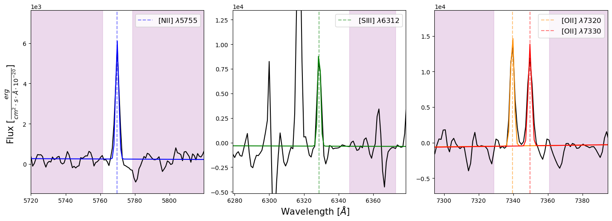

The code in this repository utilizes data from the PHANGS-MUSE Nebular catalog and data obtained from the SITELLE spectrograph at the CFHT to directly calculate metallicities in HII regions of nearby galaxies. The SITELLE data for the five galaxies that are analyzed in this project are shown here:

  

This project includes additional reduction of the SITELLE data cubes, the extraction of spectra from the SITELLE data cubes, the spectral fitting of the [OII]3727,7319,7330, [NII]5755 and [SIII]6312 features from the MUSE observations (after accounting for stellar background continuum), and the derivation of physical quantities (densities, temperatures and metallicities). Some examples of spectral fitting for auroral (faint and temperature sensitive) emission lines are shown here:

  

The `calibration_PSF.ipynb` notebook is used to visually identify point-like sources and create a catalog of objects that overlap in both the MUSE and SITELLE images. The PSF of each SITELLE pointing is also estimated using this notebook. The `montage_reproject.py` script uses the catalog of bright sources to correct the WCS information in each of the SITELLE pointings to match the WCS of the MUSE pointings. The SITELLE cubes are then reprojected into the same spatial and pixel dimensions as the MUSE observations. Spectra from the HII region masks that are developed in [Groves et al. 2023](https://doi.org/10.1093/mnras/stad114) are then used to extract HII region spectra from SITELLE.

In the `emission_line_fitting.py` script, the four auroral lines mentioned above and the [OII]3727 feature are fitted and a flux is obtained from each feature. Each flux is appended to the nebular catalog from [Groves et al. 2023](https://doi.org/10.1093/mnras/stad114). The nebular catalog and the measured line fluxes from this analysis are then used in the `physical_quantities.py` script to directly derive densities, temperatures and abundances of HII regions. In the `strong_calibration.py` script, a number of strong line metallicity prescriptions are used to estimate the metallicities. The `Paper_plots.ipynb` notebook creates all plots that are used in the manuscript as well as other comparisons. For example, the temperature-temperature relations that we find in this study: 

  

These results show that the [SIII] and [NII] temperatures are in good agreement among the three galaxies where we have detections. However, the [OII] temperature does not agree well with these temperatures. This is an expected result and has been shown numerous times throughout the literature. In this work, we demonstrate that this is most likely due to temperature inhomogeneities within HII regions. Additionally, in this work we offer alternative metallicity prescriptions to avoid biases from temperature inhomogeneities, and we explore what might be driving temperature inhomogeneities inside of HII regions. 